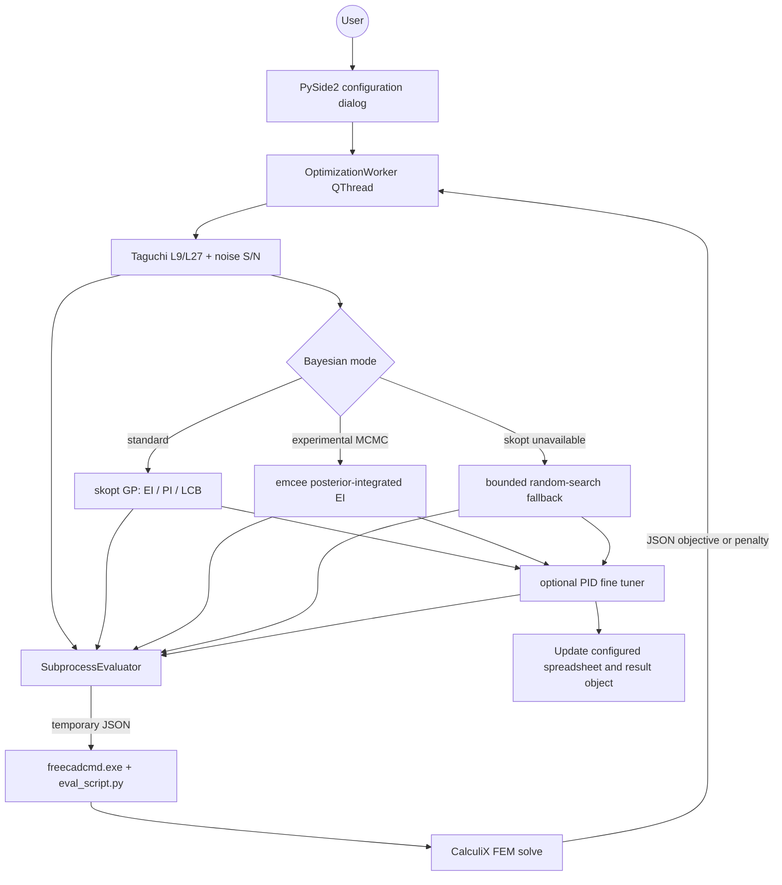

# RobustOpt — targeting FreeCAD 0.21+ (not yet certified)

RobustOpt drives an **existing, saved, spreadsheet-parametric FEM model** through Taguchi screening, Gaussian-process Bayesian optimization, and optional PID target tuning. Every FEM solve runs in a fresh native Windows `freecadcmd.exe` process; the GUI orchestration runs in a `QThread`.

## Architecture



## Installation (Windows 10)

1. Close FreeCAD. Copy the entire `RobustOpt` folder to `%APPDATA%\FreeCAD\Mod\RobustOpt`.
2. Install dependencies into FreeCAD's bundled Python (adapt the path):
   ```bat
   "C:\Program Files\FreeCAD 0.21\bin\python.exe" -m pip install -r "%APPDATA%\FreeCAD\Mod\RobustOpt\requirements.txt"
   ```
   Standard GP mode uses `requirements.txt`. Experimental MCMC mode uses `requirements-mcmc.txt`, which explicitly lists `emcee`, scikit-learn, and SciPy in addition to the base requirements. PyMC is not required. Dependency versions are intentionally unpinned because no FreeCAD/Python environment is certified yet; installation success is not guaranteed. Record and pin versions only after validating them with the exact bundled FreeCAD Python.
3. Restart FreeCAD and select **RobustOpt** in the workbench selector.

For a model-preparation and configuration guide (not a bundled runnable sample), see [TUTORIAL.md](TUTORIAL.md). For the explicit validation boundary and the currently empty certified-environment list, see [TESTED_ENVIRONMENTS.md](TESTED_ENVIRONMENTS.md).

## Static validation with FreeCAD's Python

Before opening the workbench, run the shipped helper from Command Prompt and pass the exact Python executable bundled with FreeCAD:

```bat
"%APPDATA%\FreeCAD\Mod\RobustOpt\tools\validate_with_freecad_python.bat" "C:\Program Files\FreeCAD 0.21\bin\python.exe"
```

This runs `compileall` and the pure-Python tests only. A pass does **not** load FreeCAD, run `freecadcmd.exe`, execute CalculiX, or certify FEM compatibility. Record the exact interpreter and output in `TESTED_ENVIRONMENTS.md` only after actually running it.

After manually validating a saved FEM model, copy and edit `examples/eval_request.example.json`, then run one real evaluator smoke test:

```bat
"C:\Program Files\FreeCAD 0.21\bin\python.exe" "%APPDATA%\FreeCAD\Mod\RobustOpt\tools\run_evaluator_smoke_test.py" "C:\Program Files\FreeCAD 0.21\bin\freecadcmd.exe" "C:\path\to\request.json"
```

The helper fails unless `freecadcmd.exe` exits successfully and the evaluator's final JSON record contains `"ok": true`. A pass demonstrates only that one request completed; it does not certify other models or FreeCAD versions.

## Model preparation

* Save the `.FCStd` file before starting.
* Add a Spreadsheet whose aliases drive model dimensions. Factor names entered in RobustOpt must exactly match aliases (a cell address also works).
* Create and validate a complete FEM Analysis, mesh, material, boundary conditions, loads, and CalculiX solver. Run it once manually.
* Expose the objective as a numeric property on a result object where possible. Select that object and type the exact property name (for example `MaxVonMises`). A generic result scan is the fallback.
* Noise sigma is applied additively to the corresponding spreadsheet value per Taguchi repeat. Perturbed values are intentionally not clipped to the control bounds; failed or physically invalid noise realizations receive the evaluator penalty. The optional Unit column is appended when values are written (for example `mm` or `N`). Verify auto-detected units and enter units manually for formula-driven cells.

## Use

Click **Run robust optimization**, select the spreadsheet, analysis, metric object/property, then enter factor bounds. The model path must remain the saved path of the document that opened the dialog; cross-document evaluation/application is rejected. Configure:

* **Taguchi:** L9 (up to 4 factors) or L27 (up to 8), repeat count, smaller-is-better or nominal-is-best S/N.
* **Bayesian:** iteration count and acquisition function. Standard mode uses `skopt.Optimizer` with EI, PI, or LCB. Experimental MCMC mode instead uses `emcee` to sample GP hyperparameters and averages Expected Improvement over those samples; it bypasses the `skopt` acquisition branch. If `skopt` is unavailable in standard mode, the stage logs the change and uses bounded random search rather than Bayesian optimization.
* **PID:** parameter alias, response target and gains; leave the parameter blank to disable PID.

Click **Run**. Detected evaluator errors, timeouts, and unusable results receive a large penalty and do not stop the search. The code does not independently classify every CalculiX non-convergence state if FreeCAD returns without raising. Cancellation takes effect between evaluations. On success, values are applied to the configured spreadsheet in the document that launched the dialog, and `RobustOptResult.Summary` is created or updated.

## Important implementation notes

* A subprocess opens the saved file, not unsaved GUI state. Save model changes before a run.
* Do not open the same output file for writing in subprocesses. RobustOpt changes only the subprocess's in-memory document and returns JSON.
* `freecadcmd.exe` is auto-detected from FreeCAD's home path or `PATH`; its full path can be entered in the dialog.
* The evaluator uses `femtools.ccxtools.FemToolsCcx`, whose details can vary among FreeCAD releases. If a custom solver workflow is used, adapt the solver block in `eval_script.py` while retaining its JSON contract.
* Constraints can be represented by a derived objective property that adds a penalty. FEM errors automatically receive `1e30`.

## JSON evaluator contract

Input contains `document`, `spreadsheet`, `analysis`, `parameters`, `noise`, `units`, `metric_object`, and `metric_property`. The final stdout JSON line is either `{"ok":true,"objective":...}` or `{"ok":false,"error":"..."}`. FreeCAD banner output is tolerated.

## Troubleshooting

* **Workbench absent:** verify `...\Mod\RobustOpt\InitGui.py` exists directly at that path.
* **Imports missing:** run pip with FreeCAD's `bin\python.exe`, never the system Python.
* **All objectives are 1e30:** inspect the log and run the FEM model manually; verify analysis, solver, metric object/property, and aliases.
* **Spreadsheet set fails:** aliases are case-sensitive. Check the factor's Unit column; formula-driven cells may not expose a detectable unit, so enter the required unit manually or use a dimensionless driver cell.

License: MIT.
